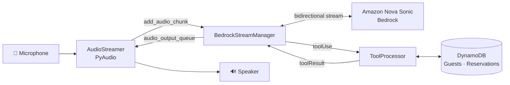
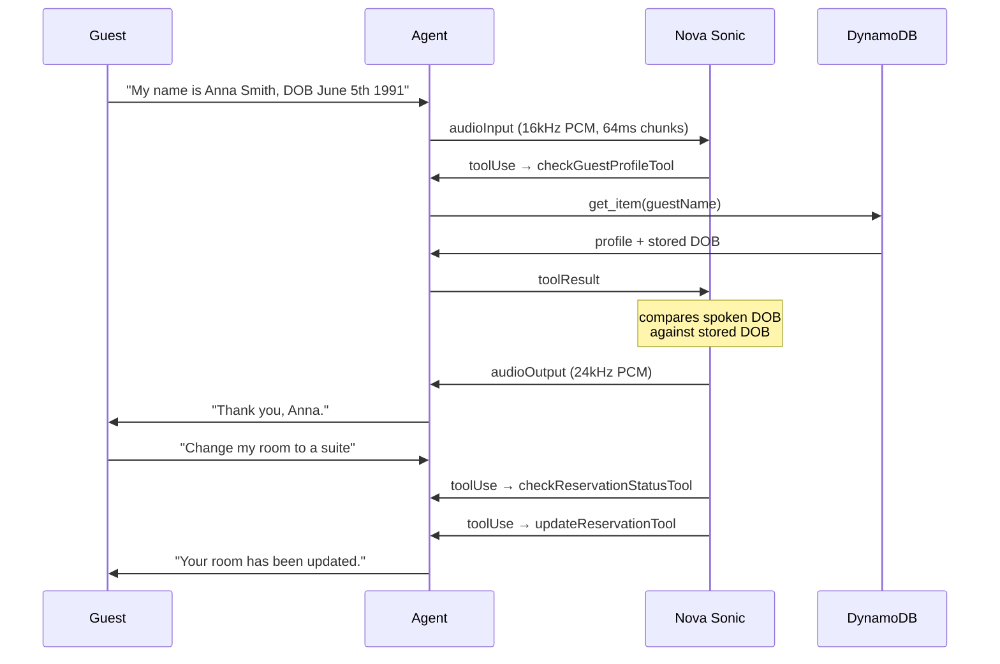

# Real-Time Voice Reservation Agent

A voice-driven hotel front-desk agent built on **Amazon Nova Sonic**. You speak to it like a receptionist: it verifies your identity, looks up your reservation in DynamoDB, and modifies it — and you can interrupt it mid-sentence.

**Median response latency: ~0.6s.** You can talk over it.

---

## Why speech-to-speech matters here

Most voice agents are a three-model pipeline:

```
speech → [Whisper] → text → [LLM] → text → [TTS] → speech
```

Three models, three network hops, latency compounding at each stage — typically 2–3 seconds before the user hears anything.

This project uses **Nova Sonic**, a speech-to-speech model. Audio goes in, audio comes out, over a single persistent bidirectional stream. There is no transcription step in the middle.

That architectural difference is why response latency here is measured in **hundreds** of milliseconds rather than seconds.

## Architecture



Three components, deliberately decoupled:

| Component | Responsibility |
|---|---|
| `AudioStreamer` | The **only** code touching audio hardware. Captures mic input, plays model output. |
| `BedrockStreamManager` | The Nova Sonic event protocol — session lifecycle, audio framing, tool handshake, barge-in. |
| `ToolProcessor` | Three DynamoDB-backed tools. Runs blocking AWS calls in an executor so the audio loop never stalls. |

`BedrockStreamManager` never imports PyAudio. It exposes exactly two seams — `add_audio_chunk()` in, `audio_output_queue` out — so the transport can be swapped (browser WebSocket, telephony stream) without touching agent logic.

## Audio pipeline

| Direction | Rate | Format | Chunk |
|---|---|---|---|
| Input (mic → model) | 16,000 Hz | mono PCM16 (LPCM), base64 | 1024 frames ≈ **64 ms** |
| Output (model → speaker) | 24,000 Hz | mono PCM16 (LPCM), base64 | 1024 frames |

Both directions are queue-buffered. The microphone callback runs on PyAudio's own thread and hands bytes to the asyncio loop via `run_coroutine_threadsafe`, so **audio capture never blocks on the network**.

### Barge-in

When Nova Sonic detects the guest speaking over the assistant, it emits an interruption signal. The handler sets a `barge_in` flag; the playback loop drains the queued assistant audio and stops mid-word, rather than talking over the guest.

This is what makes the agent feel conversational instead of like an IVR menu.

## Conversation flow



## Identity verification

The agent will not disclose **any** reservation or billing detail until it has:

1. Asked for full name and date of birth
2. Looked the guest up via `checkGuestProfileTool`
3. Confirmed the spoken DOB matches the stored DOB

A voice agent that reads out a booking to whoever calls is a data breach. The gate is enforced through tool results rather than trusting the model to remember a rule.

## Tools

| Tool | Input | Purpose |
|---|---|---|
| `checkGuestProfileTool` | `guestName` | Identity verification; returns DOB, loyalty tier, preferences |
| `checkReservationStatusTool` | `guestName`, `includePastStays?` | Upcoming stay, room details, balance due |
| `updateReservationTool` | `reservationId`, `newRoomType?`, `newSpecialRequest?` | Change room type or append a special request |

Tool calls run in a thread pool executor — a slow DynamoDB round-trip cannot stall the audio stream.

## Measured performance

From instrumented session logs across 6 live conversations:

| Metric | Value |
|---|---|
| Speech-to-response latency, median | **0.626 s** |
| Fastest turn | 0.447 s |
| Slowest turn | 2.027 s |
| Turns measured | 11 |
| Tool execution (DynamoDB round-trip) | **77–182 ms** |

Latency is measured from the final user-speech transcript event to the model's next content-start. Mid-utterance pauses that Nova Sonic segments into separate user turns are excluded — counting them would inflate the figure.

## Project structure

```
backend/
  hotel_agent.py   # Agent core: ToolProcessor, BedrockStreamManager, AudioStreamer
  db_setup.py      # Creates and seeds the two DynamoDB tables
  app.py           # Streamlit dashboard — parses session logs into events and token usage
  requirements.txt
```

## Setup

**Prerequisites:** Python 3.10+, an AWS account with Bedrock access to `amazon.nova-sonic-v1:0` in `us-east-1`, and a working microphone.

```bash
python -m venv .venv && source .venv/bin/activate
pip install -r backend/requirements.txt
```

Configure AWS credentials — the agent reads them from your environment or `~/.aws/credentials`. **No credentials belong in source.**

```bash
aws configure
```

Create and seed the tables (this **deletes and recreates** them):

```bash
cd backend
python db_setup.py
```

Run the agent:

```bash
python hotel_agent.py            # add --debug for timing traces
```

Speak into your microphone. Press Enter to stop.

Optional — the session dashboard:

```bash
streamlit run app.py
```

## Try it

Seeded guests:

| Guest | DOB | Reservation |
|---|---|---|
| Anna Smith | 1991-06-05 | Upcoming, fully paid |
| Mark Johnson | 1985-01-21 | Upcoming with balance due, plus a past stay |

A conversation that exercises all three tools:

> "Hi, my name is Anna Smith and my date of birth is June fifth, nineteen ninety-one."
> "Can you check my upcoming reservation?"
> "Could you change my room type to a suite?"

Then try interrupting mid-response.

## Current limitations

- **Runs locally only.** `AudioStreamer` requires a physical microphone and speaker, so it will not run on a headless server as-is. Swapping the transport is the intended path to browser or telephony deployment.
- **In-memory session state.** Conversation state lives on the `BedrockStreamManager` instance and is lost on exit. Nothing is persisted between runs.
- **No automated tests.** Behaviour has been verified through manual sessions; there is no scripted scenario suite yet.
- **Single-turn prompt lifecycle.** Each run opens one session and one prompt; multi-session handling is not implemented.

## Built with

Amazon Nova Sonic · AWS Bedrock Runtime (bidirectional streaming) · Python `asyncio` · PyAudio · DynamoDB · Streamlit
