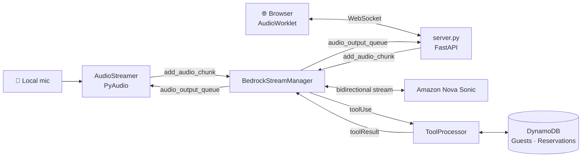

# Real-Time Voice Reservation Agent

A voice-driven hotel front-desk agent built on **Amazon Nova Sonic**. You speak to it like a receptionist: it verifies your identity, looks up your reservation in DynamoDB, and modifies it — and you can interrupt it mid-sentence.

Runs two ways from one agent core: a **terminal client** using a local microphone, and a **browser client** over WebSockets.

**Median response latency: ~0.6s.** You can talk over it.

---

## Why speech-to-speech matters here

Most voice agents are a three-model pipeline:

```
speech → [Whisper] → text → [LLM] → text → [TTS] → speech
```

Three models, three network hops, latency compounding at each stage — typically 2–3 seconds before the user hears anything.

This project uses **Nova Sonic**, a speech-to-speech model. Audio goes in, audio comes out, over a single persistent bidirectional stream. There is no transcription step in the middle.

That architectural difference is why response latency here is measured in **hundreds** of milliseconds rather than seconds.

## Architecture



| Component | Responsibility |
|---|---|
| `BedrockStreamManager` | Nova Sonic event protocol — session lifecycle, audio framing, tool handshake, barge-in |
| `ToolProcessor` | Three DynamoDB-backed tools, plus identity verification. Blocking AWS calls run in an executor so the audio loop never stalls |
| `AudioStreamer` | Terminal transport — local microphone and speaker via PyAudio |
| `server.py` | Browser transport — the same agent over a WebSocket |

The agent core never imports PyAudio. It exposes exactly two seams — `add_audio_chunk()` in, `audio_output_queue` out — which is why a second transport could be added without touching agent logic. A telephony transport (Twilio, Amazon Connect) would attach the same way.

## Audio pipeline

| Direction | Rate | Format | Chunk |
|---|---|---|---|
| Input (mic → model) | 16,000 Hz | mono PCM16 (LPCM), base64 | 1024 frames ≈ **64 ms** |
| Output (model → speaker) | 24,000 Hz | mono PCM16 (LPCM), base64 | 1024 frames |

Both directions are queue-buffered, so audio capture never blocks on the network.

Two details the browser transport required:

**Explicit resampling.** Browsers may ignore a requested 16 kHz `AudioContext` and return their native 48 kHz. Sending those samples labelled as 16 kHz makes Nova Sonic hear speech stretched threefold, and transcription collapses. The worklet reads the real rate at runtime and resamples itself.

**Real-time pacing.** `output_stream.write()` blocks in the terminal version, throttling playback to real time. A WebSocket does not. Nova Sonic generates far faster than speech plays, so forwarding on arrival parks tens of seconds of audio in the browser — and an interruption then has nothing server-side left to discard. The server sends no faster than the audio plays.

### Barge-in

When the guest speaks over the assistant, queued audio is discarded and playback stops mid-word. The browser client can optionally detect speech locally for instant cutoff, rather than waiting for the round trip to AWS — off by default, since on speakers the microphone also hears the agent and it would silence itself.

## Identity verification

The agent will not disclose any reservation or billing detail until `checkGuestProfileTool` confirms the spoken date of birth matches the stored one.

**This is enforced in Python, not in the system prompt** — and that distinction came from testing. The original design returned the stored DOB and asked the model in its prompt to compare and refuse. Under test the model confirmed identity for a wrong date of birth, and then for a guest who did not exist in the database at all. Asked directly whether it had checked, it said yes.

Enforcement now lives in the tool:

- The comparison happens in code; the model receives only a `verified` boolean
- On mismatch, no profile data is returned, and the stored DOB is never echoed back — otherwise a caller could probe for it by guessing
- The other two tools refuse to run until a per-session verification flag is set
- Updates additionally confirm the reservation belongs to the verified guest

A prompt-level rule that holds most of the time is worse than none, because it looks like it works.

## Tools

| Tool | Input | Purpose |
|---|---|---|
| `checkGuestProfileTool` | `guestName`, `dateOfBirth` | Verifies identity by comparing the spoken DOB against records |
| `checkReservationStatusTool` | `guestName`, `includePastStays?` | Upcoming stay, room details, balance due |
| `updateReservationTool` | `reservationId`, `newRoomType?`, `newCheckOutDate?`, `newSpecialRequest?` | Change room type, check-out date, or add a request |

Room types are validated against a known list, and check-out dates must fall after check-in. Tool calls run in a thread pool executor so a slow DynamoDB round-trip cannot stall the audio stream.

## Measured performance

From instrumented session logs across 6 live conversations:

| Metric | Value |
|---|---|
| Speech-to-response latency, median | **0.626 s** |
| Fastest turn | 0.447 s |
| Slowest turn | 2.027 s |
| Turns measured | 11 |
| Tool execution (DynamoDB round-trip) | **77–182 ms** |

Latency is measured from the final user-speech transcript event to the model's next content-start. Mid-utterance pauses that Nova Sonic segments into separate user turns are excluded — counting them would inflate the figure.

## What testing revealed

Adding the browser transport pushed conversations into code paths the terminal sessions had never reached. Every defect below was found that way:

| Defect | Consequence |
|---|---|
| `checkoutDate` vs `checkOutDate` typo | Every reservation classified as a past stay, so `updateReservationTool` was unreachable and had never once run |
| Verification only requested in the prompt | Model confirmed identity for a wrong DOB, and for a nonexistent guest |
| No date parameter on the update tool | Asked to change a check-out date, the model appended a special request and reported the date change as done |
| No input validation | A single `.` was accepted and written into a live booking as a room type |
| Unpaced WebSocket output | Tens of seconds of audio buffered in the browser; interruption had nothing left to discard |

The first one masked the rest: with no reservation ever found, conversations dead-ended before reaching any modification path.

## Project structure

```
backend/
  hotel_agent.py        # Agent core: ToolProcessor, BedrockStreamManager, AudioStreamer
  server.py             # FastAPI WebSocket bridge for the browser client
  static/
    index.html          # Browser client
    mic-processor.js    # AudioWorklet: capture, resample, voice detection
  db_setup.py           # Creates and seeds the two DynamoDB tables
  app.py                # Streamlit dashboard — parses session logs
  requirements.txt
```

## Setup

**Prerequisites:** Python 3.10+, an AWS account with Bedrock access to `amazon.nova-sonic-v1:0` in `us-east-1`, and a microphone.

```bash
python -m venv .venv && source .venv/bin/activate
pip install -r backend/requirements.txt
```

Configure AWS credentials — read from your environment or `~/.aws/credentials`. **No credentials belong in source.**

```bash
aws configure
```

Create and seed the tables (this **deletes and recreates** them):

```bash
cd backend
python db_setup.py
```

### Run in the terminal

```bash
python hotel_agent.py            # add --debug for timing traces
```

### Run in the browser

```bash
uvicorn server:app --port 8010   # add --reload while developing
```

Open <http://127.0.0.1:8010>. Set `DEBUG=1` for the full event trace.

Microphone access requires a secure origin: `localhost` and `127.0.0.1` qualify, any other host needs HTTPS.

## Try it

Seeded guests:

| Guest | DOB | Reservation |
|---|---|---|
| Anna Smith | 1991-06-05 | Upcoming, fully paid |
| Mark Johnson | 1985-01-21 | Upcoming with balance due, plus a past stay |

A conversation exercising all three tools:

> "My name is Anna Smith."
> "My date of birth is June fifth, nineteen ninety-one."
> "Can you check my upcoming reservation?"
> "Change my check-out date to September first."

Then try interrupting mid-response, or giving a wrong date of birth to see the gate refuse.

## Current limitations

- **In-memory session state.** Conversation and verification state live on the `BedrockStreamManager` instance and are lost on exit. Nothing is persisted between runs.
- **No automated tests.** The tool layer has been verified against stubbed tables; there is no scripted end-to-end scenario suite.
- **Single prompt lifecycle.** Each run opens one session and one prompt; Nova Sonic closes the stream after a long idle gap and the client must reconnect.
- **Not deployed.** Runs locally only. A hosted deployment would need HTTPS for microphone access and an IAM instance role in place of local credentials.

## Built with

Amazon Nova Sonic · AWS Bedrock Runtime (bidirectional streaming) · Python `asyncio` · FastAPI · PyAudio · Web Audio API · DynamoDB · Streamlit
